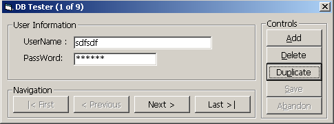



## \[  ADO Primer \]

### Description

[ADODC IS E V I L!]

Have you reached a stage when you realize that the standard ADO Data Control Shipped with VB is not enough for you?? Ever Wondered How You Can Connect To A Database with code? How You Can Read, Write, Delete, Change data in Tables ?

Well, Here's a small Application which uses ADO Code to manipulate data in a table.

I've also included code to Enable or Disable the Command Buttons in the Window based on the context (For exampling disabling First & Previous buttons when you are in the first record...).
 
### More Info
 

             |
---                |---
**Submitted On**   |2004-01-03 12:50:00
**By**             |[twistedthoughts](https://github.com/Planet-Source-Code/PSCIndex/blob/master/ByAuthor/twistedthoughts.md)
**Level**          |Intermediate
**User Rating**    |4.5 (366 globes from 81 users)
**Compatibility**  |VB 4\.0 \(16\-bit\), VB 4\.0 \(32\-bit\), VB 5\.0, VB 6\.0
**Category**       |[Databases/ Data Access/ DAO/ ADO](https://github.com/Planet-Source-Code/PSCIndex/blob/master/ByCategory/databases-data-access-dao-ado__1-6.md)
**World**          |[Visual Basic](https://github.com/Planet-Source-Code/PSCIndex/blob/master/ByWorld/visual-basic.md)
**Archive File**   |[\[\_\_ADO\_Pri168988132004\.zip](https://github.com/Planet-Source-Code/twistedthoughts-ado-primer__1-50695/archive/master.zip)

